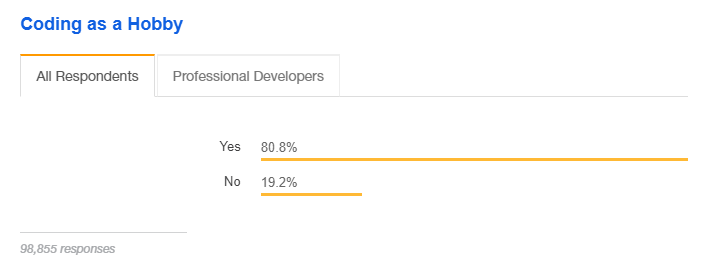
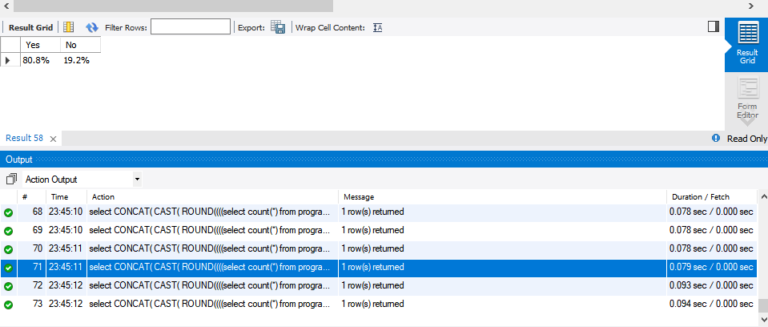
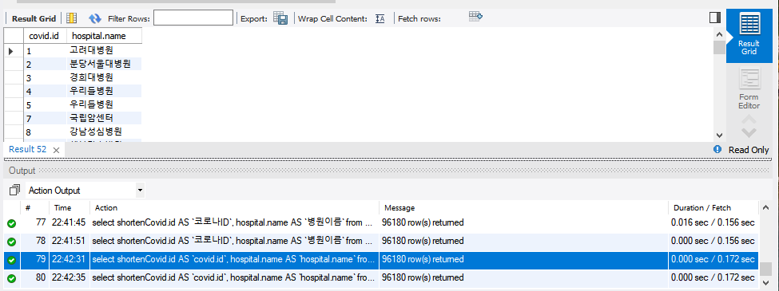
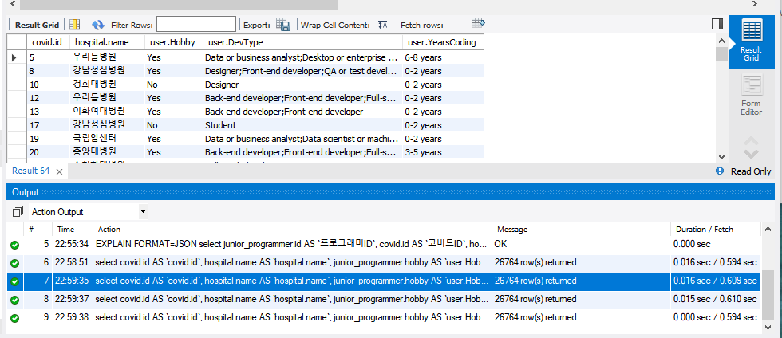
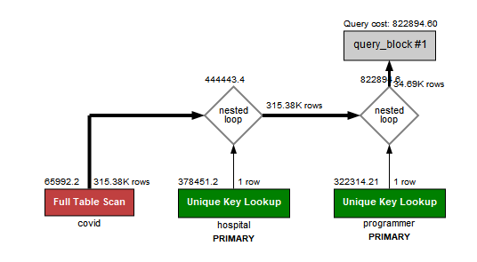

## Mission 제출 답안

### A. 쿼리 연습
#### [1. 쿼리 작성만으로 1s 이하로 반환한다]
- **다음과 같이 쿼리를 작성했어요**
```mysql
select 사원.사원번호, 사원.이름, 부서관리자_급여.연봉, 직급.직급명, 사원출입기록.입출입시간, 사원출입기록.지역, 사원출입기록.입출입구분
from (select 부서관리자.사원번호, 급여.연봉
		from 부서관리자
			JOIN 급여 ON 부서관리자.사원번호 = 급여.사원번호
		where 부서관리자.부서번호 
			 in (select 부서번호 from 부서 where LOWER(비고) = 'active') 
			 and 부서관리자.종료일자 > NOW()
			 and 급여.종료일자 > NOW()
		order by 급여.연봉 DESC 
		LIMIT 5) 부서관리자_급여 
	JOIN 사원
		ON 부서관리자_급여.사원번호 = 사원.사원번호
	JOIN 직급
		ON 부서관리자_급여.사원번호 = 직급.사원번호
	JOIN 사원출입기록
		ON 부서관리자_급여.사원번호 = 사원출입기록.사원번호
where
	직급.종료일자 > NOW() and
    사원출입기록.입출입구분 = 'O'
order by
	부서관리자_급여.연봉 DESC, 
    사원출입기록.지역;
```

- **다음과 같이 결과가 조회돼요**
    - 대략 0.3 sec가 소요됐어요
    - 

- **실행계획은 다음과 같아요**
    - 
    - 
    - where 절의 `사원출입기록.입출입구분 = 'O'` 가 테이블 풀 스캔으로 데이터 접근해요
    - order by 절의 `부서관리자_급여.연봉` 도 데이터 풀 스캔으로 데이터 접근해요
    - extra 칼럼에는 using index가 하나도 없어요
        - using temporary
        - using filesort
        - using where

#### [2. 인덱스 설정을 추가하여 50 ms 이하로 반환한다]
1. **일단 테이블 풀 스캔을 없애보기로 했어요**
    - ``create index `입출입구분` ON 사원출입기록 (입출입구분);``
    - 조금 줄어서 0.2sec 정도 소요
    - 

2. **실행 계획을 보니 여전히 사원출입기록은 너무 많이 Row를 읽어와요**
    - 

3. **사원출입기록에 사원번호, 입출입구분 두 가지 칼럼에 대해 인덱스를 걸어보았어요**
    - ``drop index `입출입구분` ON 사원출입기록;``
    - ``create index `사원번호_입출입구분` ON 사원출입기록 (사원번호, 입출입구분);``

4. **시간이 많이 줄었어요**
    - 대략 0.000sec ~ 0.015sec 정도로 계산되어요
    - 

5. **실행계획에서도 사원출입기록에서 조회해오는 Row가 2개로 감소한 것을 확인할 수 있어요.**
    - 
    - 

### B. 인덱스 설계
#### [1. Coding as a Hobby 와 같은 결과를 반환하세요.]
- **다음과 같은 값이 나와야 해요**
    - 

- **다음과 같이 쿼리를 작성했어요**
    ``` mysql
    select
        CONCAT( CAST( ROUND((((select count(*) from programmer where hobby = "Yes") / (select count(*) from programmer)) * 100), 1) AS CHAR(4)), "%") AS `Yes`,
        CONCAT( CAST( ROUND((((select count(*) from programmer where hobby = "No") / (select count(*) from programmer)) * 100), 1) AS CHAR(4)), "%") AS `No`;
    ```

- **인덱스를 적용하지 않은 경우, 대략 650ms 갸량 소요되어요**
    - 

- **인덱스를 적용해볼게요**
    - 현재로서는 인덱스가 전혀 적용되어 있지 않아요
    - ``create index `hobby_id` on programmer (`hobby`, `id`);`` 다음과 같이 hobby와 id를 혼합하여 다중 컬럼 인덱스를 만들었어요
        - 사실 hobby가 yes/no로 만 나뉘어 카디널리티가 높지 않아서 효율성이 걱정됩니다
        - 

- **인덱스 적용 후, 대략 80ms~90ms 정도 소요되어요**
    - 

- **실행 계획도 인덱스를 사용하는 방식으로 변경되었어요**
    - 

#### [2. 프로그래머별로 해당하는 병원 이름을 반환하세요. (covid.id, hospital.name)]
- **PK 부터 추가해볼게요**
    - PK가 Unique Key Lookup 이라 더 빠른걸 깜빡했어요. 
    - 모든 인덱스를 폐기하고 PK를 다음과 같이 추가했어요
    ```mysql
    alter table covid add constraint primary key(id);
    alter table programmer add constraint primary key(id);
    alter table hospital add constraint primary key(id);
    ```

- **다음과 같이 쿼리를 작생했어요**
    ```mysql
    select shortenCovid.id AS `covid.id`, hospital.name AS `hospital.name`
    from hospital
        join (select hospital_id, id from covid where programmer_id > 0) AS shortenCovid  
            on hospital.id = shortenCovid.hospital_id;   
    ```

- **다음과 같은 인덱스를 추가했어요**
    ``` mysql
    create index `programmer_id_hospital_id` on covid(`programmer_id`, `hospital_id`);
    ```
    - 실행계획은 다음과 같아요
        -  
    - 다음과 같은 결과가 나왔어요. duration_time이 0.000sec에요. 
        - (네트워크와 관련한 fetch time이 100ms 이하로 떨어져야 하는줄 알았답니다ㅜㅜ)
        -    

#### [3. 프로그래밍이 취미인 학생 혹은 주니어(0-2년)들이 다닌 병원 이름을 반환하고 user.id 기준으로 정렬하세요. (covid.id, hospital.name, user.Hobby, user.DevType, user.YearsCoding)]
- **다음과 같이 쿼리를 작성했어요**
    - 앞서 b-2에서 걸어둔 테이블의 pk는 유효해요
    ```mysql    
    select covid.id AS `covid.id`, hospital.name AS `hospital.name`, junior_programmer.hobby AS `user.Hobby`, junior_programmer.dev_type AS `user.DevType`, junior_programmer.years_coding AS `user.YearsCoding`
        from (select id, hobby, dev_type, years_coding
            from programmer
            where (student like "Yes%" and hobby = "Yes") or years_coding = "0-2 years") AS junior_programmer
        join covid
            on junior_programmer.id = covid.programmer_id
        join hospital
            on covid.hospital_id = hospital.id;
    ```
    - 대략 0.016sec 가 소요되어요
        - 
    - 실행 계획은 다음과 같아요
        - 

- **시간이 많이 소요되지 않았다고 판단해, 인덱스는 걸지 않기로 했어요**

#### [서울대병원에 다닌 20대 India 환자들을 병원에 머문 기간별로 집계하세요. (covid.Stay)]

#### [서울대병원에 다닌 30대 환자들을 운동 횟수별로 집계하세요. (user.Exercise)]
