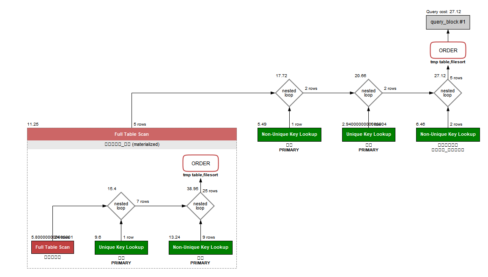

## Mission 제출 답안

### A. 쿼리 연습
#### [1. 쿼리 작성만으로 1s 이하로 반환한다]
- **다음과 같이 쿼리를 작성했어요**
```mysql
select 사원.사원번호, 사원.이름, 부서관리자_급여.연봉, 직급.직급명, 사원출입기록.입출입시간, 사원출입기록.지역, 사원출입기록.입출입구분
from (select 부서관리자.사원번호, 급여.연봉
		from 부서관리자
			JOIN 급여 ON 부서관리자.사원번호 = 급여.사원번호
		where 부서관리자.부서번호 
			 in (select 부서번호 from 부서 where LOWER(비고) = 'active') 
			 and 부서관리자.종료일자 > NOW()
			 and 급여.종료일자 > NOW()
		order by 급여.연봉 DESC 
		LIMIT 5) 부서관리자_급여 
	JOIN 사원
		ON 부서관리자_급여.사원번호 = 사원.사원번호
	JOIN 직급
		ON 부서관리자_급여.사원번호 = 직급.사원번호
	JOIN 사원출입기록
		ON 부서관리자_급여.사원번호 = 사원출입기록.사원번호
where
	직급.종료일자 > NOW() and
    사원출입기록.입출입구분 = 'O'
order by
	부서관리자_급여.연봉 DESC, 
    사원출입기록.지역;
```

- **다음과 같이 결과가 조회돼요**
    - 대략 0.3 sec가 소요됐어요
    - 

- **실행계획은 다음과 같아요**
    - 
    - 
    - where 절의 `사원출입기록.입출입구분 = 'O'` 가 테이블 풀 스캔으로 데이터 접근해요
    - order by 절의 `부서관리자_급여.연봉` 도 데이터 풀 스캔으로 데이터 접근해요
    - extra 칼럼에는 using index가 하나도 없어요
        - using temporary
        - using filesort
        - using where

#### [2. 인덱스 설정을 추가하여 50 ms 이하로 반환한다]
1. 일단 테이블 풀 스캔을 없애보기로 했어요
    - ``create index `입출입구분` ON 사원출입기록 (입출입구분);``
    - 조금 줄어서 0.2sec 정도 소요
    - 
2. 실행 계획을 보니 여전히 사원출입기록은 너무 많이 Row를 읽어와요
    - 
3. 사원출입기록에 사원번호, 입출입구분 두 가지 칼럼에 대해 인덱스를 걸어보았어요
    - ``drop index `입출입구분` ON 사원출입기록;``
    - ``create index `사원번호_입출입구분` ON 사원출입기록 (사원번호, 입출입구분);``
4. 시간이 많이 줄었어요
    - 대략 0.000sec ~ 0.015sec 정도로 계산되어요
    - 
5. 실행계획에서도 사원출입기록에서 조회해오는 Row가 2개로 감소한 것을 확인할 수 있어요. 
    - 
    - 